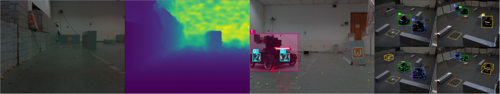

# Neurons Dataset API - The official dataloader and visualization tools for Neurons Datasets.
## Introduction
We propose our dataloader API for loading and visualizing our RoboMaster opensource datasets. The datasets includes:
 
 * Sentry detection data [DRL-CASIA/MVM3D](https://github.com/DRL-CASIA/MVM3D)
 * Vehicle mounted detection data [DRL-CASIA/ABCP](https://github.com/DRL-CASIA/ABCP), [DRL-CASIA/Detection-Datasets-for-ABCP](https://github.com/DRL-CASIA/Detection-Datasets-for-ABCP).
 * Vehicle mounted depth estimation data (In progress).
 
 
 
## Dependencies
Note that this API is only tested on ubuntu/Mac devices which has:
* python 3.6+
* torch 1.7.1
* torchvision 0.8.2
* ...

    
 
## Installation
First, clone this repo:
```
git clone git@github.com:DRL-CASIA/NeuronsDataset.git
cd NeuronsDataset
```
Then, pack the code into wheel packages for later installation:
```
conda activate YourEnv  # Activate your python environment first.
cd src
pip3 setup.py bdist_wheel
```
The commands above are expected to generate a whl file and several folders.

Next, install the whl package into your python3 environment using pip:
```
cd dist
pip3 install neuronsdataset-1.0-py3-none-any.whl
```
The generated folders could be safely deleted after installing the API.

## Usage
Please refer to [main.py](main.py) for details.

We also provide samples of dataset mentioned in [Introduction](#introduction) section, which are contaied in [sample_data](sample_data).